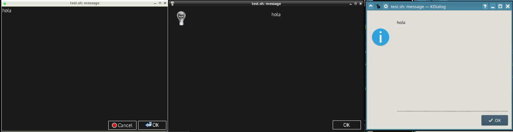

EasyBashGUI
===========

Simplified way to code bash made GUI frontend dialogs! Check the youtube video:

<a href="http://www.youtube.com/watch?feature=player_embedded&v=FEn4doXmiX0" target="_blank">
 
</a>

## Introduction to EBG

... There is [bashlib](https://github.com/cyberark/bash-lib) that is for the code 
itselft, well so for the GUIs there is **EasyBashGUI** then!

**E**asy **B**ash **G**ui shortened as EBG, is a Posix compliant Bash functions 
library that aims to give unified GUI functions using frontends for dialogs boxeds 
(from the user's point of view are frontends but from the EGB side are backends)

#### Backends environments GUI

EBG implements different dialogs boxes! You don't have to worry about what 
environment you are running the script in, as **EasyBashGUI** will handle this 
transparently, based on the availability of the backends (frontends).

* Console mode:
  * dialog
  * cdialog
* Graphical mode:
  * yad
  * gtkdialog
  * kdialog
  * zenity
  * xdialog



#### Compatibility and runtime

EBG is coded in `bash`, and uses most of `coreutils` commands, but it may work in
any other environment, because those are just used internally.

## Components

EBG is fully modular:

* `easybashgui` a launcher that will be the endpoint sourced in your scripts
* `easybashgui-debug` that toggles some debug options managed by the previous component
* `easybashgui.lib` that managed the backends, called as widget library
* `easydialog-legacy` stand-alone to create dialog boxes externally (as old nowadays)
* `easybashlib` used for for optional functions like cleaning temporally working dir

## Quick start

``` bash
source easybashgui

message "hola"
```

Pretty easy!? right? Read the "Quick start usage" section at the [docs/README.md](docs/README.md#quick-start-usage)

### INSTALLATION

Please check [docs/install.md](docs/install.md) document file!

### Documentation

Please check [docs/README.md](docs/README.md) document file!

### Packages

There are for some distros: [    ](https://software.opensuse.org//download.html?project=home%3Avenenux%3Abashgui&package=easybashgui)


## Credits.

* Thanks to Bash, Yad, Gtkdialog, Xdialog, Kdialog, Zenity, Cdialog, and Whiptail authors, this library was nothing without their work. Many thanks.
* Thanks to PICCORO McKAY Lenz for his efforts and *excellent* work on README (and bug hunting too).
* Thanks to zen0bit for first try and README impulse revival.
* Thanks to Frank Dietermann for suggestion though to make EBG "posix compliant" (since vers. 11.X.X )
* Thanks to Jose Joao Dias de Almeida for the makefile tip.
* Thanks to Chris "cgat" for his many ideas and suggestions that lead to version's "5.X.X" EasyBashGUI "revolution".
* Thanks to Davide Depau for his tests and support, and his effort to make EasyBashGUI Debian policy compliant, and finally for his man page.
* Thanks to Christian Prause for his patience and Git support.
* Thanks to Lucio Messina for "Debian policy" tips and support.

Please, let me know if my work has been useful for you.

**Vittorio Cagnetta** `<vaisarger at gmail dot com>`

https://github.com/BashGui/easybashgui

## LICENSE

GPLv3+, check [LICENSE](LICENSE) file!

