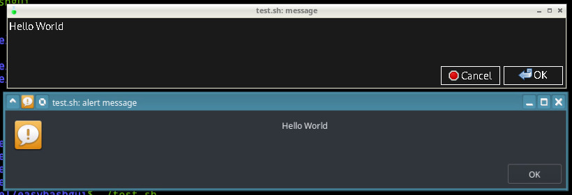
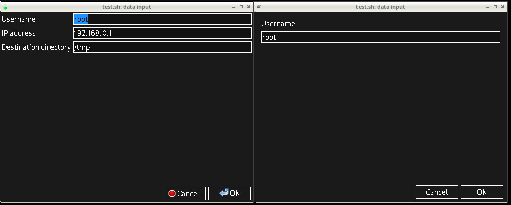
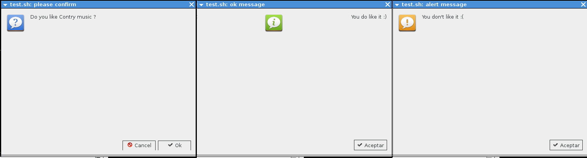
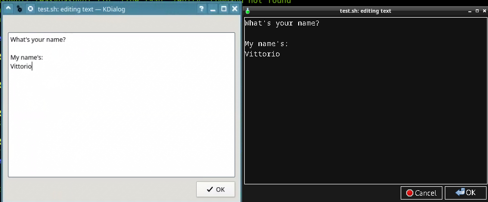
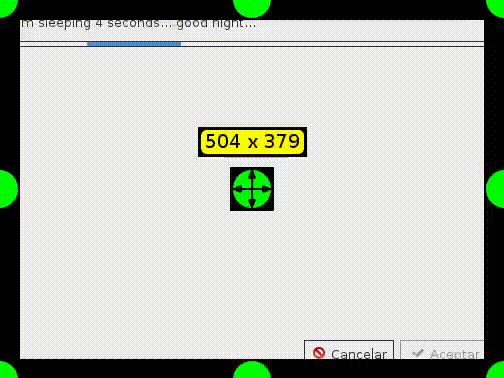
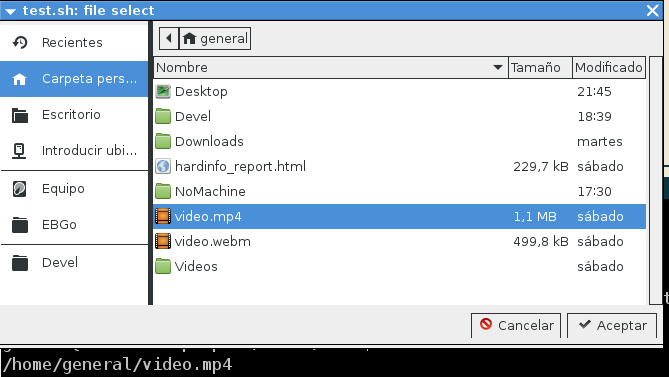
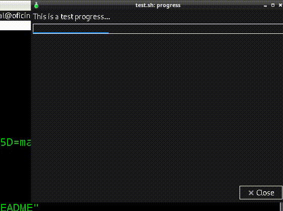

EasyBashGUI - documentation
===========================

Simplified way to code bash made GUI frontend dialogs! - Documentation

- [Modes of use](#modes-of-use)
- [Installation](#installation)
    - [Quick start usage](#quick-start-usage)
    - [Quick developer usage](#quick-developer-usage)
- [EBG Framework](#ebg-framework)
    - [Examples](#examples)
- [EBG Reference](#ebg-reference)
    - [Notes](#notes)

## Modes of use

You can use as system-wide module lib or as built-in quick start module embedded!

## Installation

Please check [install.md](install.md) document file for any way of installation,
or just check next section for a more easy and modular way of usage:

#### Quick start usage

Let's assume you have the EBG installed on system-wide, then there 
are only few steps :

```bash
mkdir ~/Devel/newprj && cd ~/Devel/newprj

echo -e "source easybashgui\nmessage hola" > ~/Devel/easybashgui/newprogram

bash ~/Devel/easybashgui/newprogram
```

That's it !!!!! Easyle! But what if you wants all build-in!? Without install?, 
of course you can! Check next section:

#### Quick developer usage

But what if we want everything to be within our project, as developers or 
embedding the EBG?, to make our program independent of the installation:

```bash
mkdir ~/Devel && cd ~/Devel && git clone https://github.com/BashGui/easybashgui

cd ~/Devel/easybashgui

ln -s lib/easybashlib easybashlib && ln -s lib/easybashgui.lib easybashgui.lib

echo -e "source src/easybashgui\nmessage hola" > ~/Devel/easybashgui/newprogram

bash ~/Devel/easybashgui/newprogram
```

That's it !!!!! You develop your first GUI script!

## EBG Framework

EBG is fully modular, you create a new script and just sourced the endpoint:

* `easybashgui` a launcher that will be the endpoint sourced in your scripts
* `easybashgui-debug` that toggles some debug options managed by the previous component
* `easybashgui.lib` that managed the backends, called as widget library
* `easydialog-legacy` stand-alone to create dialog boxes externally (as old nowadays)
* `easybashlib` used for for optional functions like cleaning temporally working dir

- Index documentation
    - [The EBG script](#the-ebg-script)
    - [Backend Widget support](#backend-widget-support)
    - [The supermode for backend widget](#the-supermode-for-backend-widget)
    - [System wide usage vs module user usage](#system-wide-usage-vs-module-user-usage)
    - [Backend boxes priority](#backend-boxes-priority)
    - [Box mode windows](#box-mode-windows)
    - [Size box windows](#size-box-windows)
    - [Boxes behavior compatibility](#boxes-behavior-compatibility)
- [Examples](#examples)
    - [Simple question boxes](#simple-question-boxes)
    - [Simple text box from standard input](#simple-text-box-from-standard-input)
    - [The waiting for response](#the-waiting-for-response)
    - [Simple directory selection](#simple-directory-selection)
    - [Triplet input examples](#triplet-input-examples)
    - [Progress bar](#progress-bar)
    - [Level meter](#level-meter)
    - [Menu selection](#menu-selection)
    - [Choose items](#choose-items)
    - [A more complex example](#a-more-complex-example)
    - [A notification example](#a-notification-example)
- [EBG Reference](#ebg-reference)
    - [Flow](#flow)
    - [message](#message)
    - [ok_message](#ok_message)
    - [alert_message](#alert_message)
    - [question](#question)
    - [text](#text)
    - [wait_seconds (progress bar)](#wait_seconds-progress-bar)
    - [progress (progresive way)](#progress-progresive-way)
    - [progress (regresive way)](#progress-regresive-way)
    - [wait_for](#wait_for)
    - [terminate_wait_for](#terminate_wait_for)
    - [fselect](#fselect)
    - [dselect](#dselect)
    - [input](#input)
    - [menu](#menu)
    - [tagged_menu](#tagged_menu)
    - [list](#list)
    - [adjust](#adjust)
    - [notify_message](#notify_message)
    - [notify_change](#notify_change)
    - [notify](#notify)
- [Notes](#notes)

#### The EBG script

The script that will implement the EBG is always structured in three main parts:

1. The optional `supermode` variable and the mandatory sourced endpoint
2. The source code made by yourself that must be `bash` language
3. The optional `clean_temp` sentence for user mode only

```bash
#!/bin/bash
# part 1 environment variables and endpoint
export supermode="zenity"
source /path/easybashgui
# part 2 .. code here
message "hola"
# part 3 the finally sentences or output manipulation
echo $?
clean_temp
```

The most simple example of a EBG script is:

```bash
source ./easybashgui

message "hola"
```

#### Backend Widget support

EBG implements different dialogs boxes! You don't have to worry about what 
environment you are running the script in, as **EasyBashGUI** will handle this 
transparently, based on the availability of the widget backends (frontends).

* Console mode:
  * gum
  * dialog
  * whiptail (not selectable, just fall back)
* Graphical mode:
  * yad
  * gtkdialog
  * kdialog
  * zenity
  * xdialog

If there is no dialog/cdialog support installed. Check next section about `supermode`!

#### The supermode for backend widget

The backends for frontends (the widgets to use to display boxes) are selectable 
by the `supermode` environment variable.

The `supermode` environment variable is only used to force or manually select 
a specific widget , by example using `kdialog` under GTK desktop, or by example 
using `zenity` under KDE environment. 

There is no `whiptail` mode because is used only as fallback! when dialog/cdialog 
is missing, if whiptail is present, just use `supermode=dialog` for!

#### System wide usage vs module user usage

If EBG is not installed you should have at least all the files in the same path
as your main script, if you install it on the system you don't have to worry
about this!

A program/project that implements EBG and does not use same path from main script, 
can put the EBG script and files in another path, but structure must be in the same 
[hierarchy indicated in the installation guide "Install path" section.](install.md#install-paths) 

The USER way must have full path to the endpoint or the files must be in the
same path of the script you made:

```bash
#!/bin/bash
source ./easybashgui
# .. code here
clean_temp
```

The SYSTEM way just need endpoint without path and the files must be in system
paths, the script you made should look like:

```bash
#!/bin/bash
source easybashgui
# .. code here
```

The difference in modes is just two: first you noted that source endpoint does 
not have a path (in the USER mode is "`./`") and second the SYSTEM mode does not 
need to clean temporally files (in the USER mode is `clean_temp`).

If easybashlib is present and successfully loaded, you can avoid last sentence 
of `clean_temp` to remove temporary files; otherwise DO NOT forget to
write `clean_temp` at the end of all your scripts... ;-)

#### Backend boxes priority

EBG support for backend boxed dialogs depends on the running programs:

1. If all the required backends are available or at least kdialog are.. the EBG
   will try to check if kdebin is running and only will use kdialog.
2. If only GTK based are running, the EBG will just use yad (or zenity ), even if xdialog
   is available and there is no desktop managers running (only window managers or similar.. )


#### Box mode windows

The backend window can be forced using the `supermode` environment variable to
the program backend of choice:

```bash
export supermode="kdialog"

source easybashgui

message "hola"
```


#### Size box windows

All windows functions support options `<-w|-width> [integer]` and `<-h|-height> [integer]` 
for custom window size with exception of `notify_message` and earlier versions 
of kdialog !

```bash
source easybashgui

message -w 800 -h 100 "Hello World!"
```



#### Boxes behavior compatibility

**IMPORTANT**: Each interface GUI has its own way of entering from the user,
while Yad can have 3 text entry boxes at the same time, on the contrary, Zenity
can only have one at a time, you can see this in the examples below



## Examples

You must make the scripts in `bash` language, EBG is coded in `bash`, in this document
We'll use bash to illustrate example uses:

1. Install EBG or source the minimum 3 files
2. Create your new program script 
3. Source the main endpoint of EBG (check following examples)
4. Put your sentences of code in bash
5. Saves and launch the new script program

- List of examples:
    - [Simple question boxes](#simple-question-boxes)
    - [Simple text box from standard input](#simple-text-box-from-standard-input)
    - [The waiting for response](#the-waiting-for-response)
    - [Simple directory selection](#simple-directory-selection)
    - [Triplet input examples](#triplet-input-examples)
    - [Progress bar](#progress-bar)
    - [Level meter](#level-meter)
    - [Menu selection](#menu-selection)
    - [Choose items](#choose-items)
    - [A more complex example](#a-more-complex-example)
    - [A notification example](#a-notification-example)

#### Simple question boxes

This piece of code will launch 3 dialogs, the first is the main question with a
default "ok" button for positive answer, in limited backend boxes will only show
a unique "ok" button and for cancel you just press "ESC" key.. If the negative 
response (cancel) is detected will launch an alert message box or then response 
box with confirmation.

```bash
source easybashgui

question "Do you like Country music ?"
answer="${?}"
if [ ${answer} -eq 0 ]
	then
	ok_message "You do like it :)"
elif [ ${answer} -eq 1 ]
	then
	alert_message "You don't like it :("
else
	ok_message "See you"
	exit 0
fi
```



#### Simple text box from standard input

This piece of code will launch a text box inside a window but using pipes 
to parsed to STDIN and the `text` function:

```bash
source easybashgui

echo -e "What's your name?\n\nMy name's:\nVittorio" | text
```



#### The waiting for response

It create a box window with such text and returns control to main program... 
during that you can made more commands, all of this time such box window with 
progress bar will be present while your following commands will be executed, 
after all of those job, you can close with an specific special function:

```bash
source easybashgui

wait_for "I'm sleeping 4 seconds... good night..."
sleep 4
terminate_wait_for
```

Take into consideration that `terminate_wait_for` only will close (kill) the 
last executed `wait_for` function launched, otherwise you must parse as argument 
the specific PID of the window box to close.



#### Simple directory selection

This piece of code will let user to choose a full path file with directory
choose dialog for file selection, standard output echoes the selection.

```bash
source easybashgui

fselect
file="$(0< "${dir_tmp}/${file_tmp}" )"
```



#### Triplet input examples

This double check of same question, with default "ok" button for positive
answer, in limited backend boxeswill only show a unique "ok" button
and for cancel you just press "ESC" key.. but in any part of the execution
the cancel will end all the program.

Last box is the extra second input, then the script will store all the variables
and will show in standard output!

```bash
source easybashgui

input 1 "(write here IP address)"
input 1 "Please, write IP address" "192.168.1.1"
input 3 "Username" "root" "IP address" "192.168.0.1" "Destination directory" "/tmp"
IFS=$'\n' ; choices=( $(0< "${dir_tmp}/${file_tmp}" ) ) ; IFS=$' \t\n'
user="${choices[0]}"
ip="${choices[1]}"
dir="${choices[2]}"
```


#### Progress bar

You can piped the progress count to a text of a box:

```bash
source easybashgui

for i in 10 20 30 40 50 60 70 80 90 100
    do
    echo "${i}"
    sleep 1
done | progress "This is a test progress..."
```



#### Level meter

Level meters are easy to set, result of the choose will be echoed to standard
output:

```bash
source easybashgui

adjust "Please, set Volume level" 15 40 75
```

#### Menu selection

The menus are complex process internally but easy to use for you, 
it's just elements and the choosen one will be in the temporally file;

```bash
menu "Red" "Yellow" "Green"
choice="$(0< "${dir_tmp}/${file_tmp}" )"
```

#### Choose items

Same as menus but allows to choose more than one item to you, 
it's just elements and the selections will be in the temporally file;

```bash
list "+Red" "-Yellow" "+Green"
choice_list="$(0< "${dir_tmp}/${file_tmp}" )"
IFS=$'\n' ; choice_array=( $(0< "${dir_tmp}/${file_tmp}" ) ) ; IFS=$' \t\n'
```

#### A more complex example: progress bar by steps

```bash
source easybashgui

women=( Angela Carla Michelle Noemi Urma Marisa Karina Anita Josephine Rachel )
for (( index=0 ; index < ${#women[@]} ; index++ })) 
	do
	today_prefered_woman="${women[${index}]}"
	kiss "${today_prefered_woman}"
	sleep 1
	#
	# Job done !!
	# then...
	echo "PROGRESS"
	#
done | progress "This is a _LOVE_ progress..." "${#women[@]}"
# if you use "PROGRESS" string in STDIN do not forget second argument ( "[elements number]" )
```

#### A notification example

This is only possible with Yad backend:

```bash
source easybashgui

notify -t "Good tooltip:OK#Bad tooltip:BAD" -i "/usr/local/share/pixmaps/nm-signal-100.png#gtk-fullscreen" "Xclock" "xclock" "Xcalc" "xcalc"
#
while :
	do
	menu GOOD BAD
	answer=$(0< "${dir_tmp}/${file_tmp}" )
	#
	if [ "${answer}" = "GOOD" ]
		then
		notify_message "Changed in \"good\" ..."
		notify_change "good"
	elif [ "${answer}" = "BAD" ]
		then
		notify_message "Changed in \"bad\" ..."
		notify_change -i "gtk-help" -t "This tooltip is bad" "bad"
	else
		exit
	fi
	#
done
```

## EBG Reference

This is the reference list documentation for programming

- List of functions:
    - [Flow](#flow)
    - [message](#message)
    - [ok_message](#ok_message)
    - [alert_message](#alert_message)
    - [question](#question)
    - [text](#text)
    - [wait_seconds (progress bar)](#wait_seconds-progress-bar)
    - [progress (percent way)](#progress-percent-way)
    - [progress (step way)](#progress-step-way)
    - [wait_for](#wait_for)
    - [terminate_wait_for](#terminate_wait_for)
    - [fselect](#fselect)
    - [dselect](#dselect)
    - [input](#input)
    - [menu](#menu)
    - [tagged_menu](#tagged_menu)
    - [list](#list)
    - [adjust](#adjust)
    - [notify_message](#notify_message)
    - [notify_change](#notify_change)
    - [notify](#notify)

#### Flow

EBG always use STDIN and STDOUT in conjunction with a temporally directory/filename.

The temporally names are managed through the variables `${dir_tmp}` and `${file_tmp}`

#### message

The most simple, its just a normal window

* ARGUMENTS:
    * text : optional, must be inside double quotes, only alphanumeric characters
* STDIN: no
* STDOUT: 
    * exit code: 1 canceled with ESC, 0 the only button is pressed
* STDERR: no

``` bash
message "[text]"
```

#### ok_message

Same as message but support response and reports question class to window manager

* ARGUMENTS:
    * text : optional, must be inside double quotes, only alphanumeric characters
* STDIN: no
* STDOUT: 
    * exit code: 1 canceled with ESC, 0 the only button is pressed
* STDERR: no


``` bash
ok_message "[text]"
```

#### alert_message

Same as message but support response and reports alert class to window manager

* ARGUMENTS:
    * text : optional, must be inside double quotes, only alphanumeric characters
* STDIN: no
* STDOUT: 
    * exit code: 1 canceled with ESC, 0 the only button is pressed
* STDERR: no


``` bash
alert_message "[text]"
```

#### question

Same as message but will offers extra button to user to cancel, the only difference 
is that supports output to both SDTERR and exit code:

* ARGUMENTS:
    * text : optional, must be inside double quotes, only alphanumeric characters
* STDIN: no
* STDOUT: 
    * exit code: 1 canceled with ESC, 0 the only button is pressed
* STDERR:
    * exit code: 1 canceled with ESC, 0 the only button is pressed

``` bash
question "[text]"
```

#### text

It will offers a canvas layer to user to write, from the user input and 
also can present a predefined text from STDIN, it supports output to 
both SDTERR and STDOUT and exit code will present the contents:

* ARGUMENTS: no
* STDIN: can be piped/redirect for predefined content
    * input: user can write
* STDOUT: 
    * (input): the content of box is write to `${dir_tmp}`/`${file_tmp}`
* STDERR:
    * (input): the content of the box input will be out

``` bash
text <<< "<text>"
```

* `${dir_tmp}` is a random path directory to place the file containing the next file
* `${file_tmp}` random file name where is content has the values one line per input
* Only for kdialog, zenity, and Xdialog you can also edit text inside the box

#### wait_seconds (progress bar)

This is an utility function, similar to `sleep`, but will display an automatic 
progress bar with a duration of the number os seconds you parse it:

* ARGUMENTS:
    * seconds : mandatory, integer only
* STDIN: no
* STDOUT: 
    * exit code: 0 unless its canceled externally, will be anything
* STDERR:
    * exit code: 0 unless its canceled externally, will be anything

``` bash
wait_seconds <integer>
```

#### progress (percent way)

This is an utility function, similar to `wait_seconds`, it will show a box with 
a bar that will fill at the number percent position, the number to select the 
percent position is read from STDIN, the number can be piped or parsed from:

* ARGUMENTS:
    * text : optional, must be inside double quotes, only alphanumeric characters
* STDIN:
    * integer: integer with or without "%" that indicates how much will fil the bar
* STDOUT: 
    * exit code: 0 unless its canceled externally, will be anything
* STDERR:
    * exit code: 0 unless its canceled externally, will be anything

``` bash
(echo "10" ; sleep 1 ; echo "50" ; sleep 1 ; echo "100" ; sleep 1 ) | progress "Percent..."
```

* To create a progress sequence you must have several statements with different 
numbers that indicate the progress

#### progress (step way)

Similar to `progress` but using element number indicator, it will show a box with 
a bar that will fill at the number elements to left, the number to select the 
percent position is read from argument, the word "PROGRESS" must be piped or parsed 
from the STDIN to the function to indicate to fil the progress bar in the box:

* ARGUMENTS:
    * text : required, must be inside double quotes, only alphanumeric characters
    * integer : required, must be inside double quotes, only alphanumeric characters
* STDIN:
    * PROGRESS: must be sent to indicate to fill the bar
* STDOUT: 
    * exit code: 0 unless its canceled externally, will be anything
* STDERR:
    * exit code: 0 unless its canceled externally, will be anything

``` bash
(echo "PROGRESS" ; sleep 1 ; echo "PROGRESS" ; sleep 1 ) | progress "Steps..." 2
```

#### wait_for

This is an utility function, similar to `progress`, it will show a box with 
a dynamic progress bar and the text you parse it, the box never close either
never ends, you should do something with their control variable`{wait_for__PID}`

* ARGUMENTS:
    * text : optional, must be inside double quotes, only alphanumeric characters
* STDIN: no
* STDOUT: 
    * `wait_for__PID` : control variable used to kill the action/function
    * exit code: 1 canceled with ESC, 0 the only button is pressed
* STDERR:
    * `wait_for__PID` : control variable used to kill the action/function
    * exit code: 1 canceled with ESC, 0 the only button is pressed

``` bash
wait_for "[text]"
sleep 3
kill -9 ${wait_for__PID}
```

#### terminate_wait_for

This is an utility function, usefully to terminate inherit process using the 
last exit code or the variable`{wait_for__PID}` from the previous function:

* ARGUMENTS:
    * PID : optional, numeric PID of the process to terminate and capture the result
* STDIN: no
* STDOUT: 
    * exit code: 1 if PID not found, 0 if process was terminated
* STDERR:
    * exit code: 1 if PID not found, 0 if process was terminated

``` bash
message "[text]" && terminate_wait_for
```

In this example the `terminate_wait_for` output "1" because PID of `message` was 
terminated previously (ok button pushed), and PID is gone and not valid anymore!

``` bash
wait_for "[text]"
sleep 3
... more code
terminate_wait_for
```

In this example the `terminate_wait_for` output "0" because PID of `wait_for` was 
active, PID is still valid and output in STDOUT that is STDIN for `terminate_wait_for`

#### fselect

This function will permit to choose a file and will let to you to use into the 
variables `${dir_tmp}`/`${file_tmp}` and STDERR to check the result of the input

* ARGUMENTS:
    * path : optional, string path of the default place to suggest for file
* STDIN: no
* STDOUT: 
    * path+file selected: the path and name of the chosen selected file from box
* STDERR:
    * path+file selected: the path and name of the chosen selected file from box

Those variables are filled when the action its completed:

* `${dir_tmp}` is a random path directory to place the file containing the next file
* `${file_tmp}` a random file name where is content has the path of the chosen file

``` bash
fselect "[/path/to/directory/[filesuggested]]"
```

#### dselect

This function will permit to choose a directory and will let to you to use into the 
variables `${dir_tmp}`/`${file_tmp}` and STDERR to check the result of the input

* ARGUMENTS:
    * path : optional, string path of the default place to suggest for path to choose
* STDIN: no
* STDOUT: 
    * path choose: the path and name of the chosen selected directory from the box
* STDERR:
    * path choose: the path and name of the chosen selected directory from the box

Those variables are filled when the action its completed:

* `${dir_tmp}` is a random path directory to place the file containing the next file
* `${file_tmp}` a random file name where is content has the path of the chosen dir

``` bash
fselect "[/path/to/directory/]"
```

#### input

This function will display in same box one, two and/or three inputs, depending 
of the parameters and can be initialized with default values as suggestions, 
and will let to you to use into the variables `${dir_tmp}`/`${file_tmp}` 
and STDERR to check the result of the input

* ARGUMENTS:
    * inputs : required, indicates the number of inputs, can be 1, 2, or 3
    * label : required, it is repeated as many inputs as indicated
    * init : required, follows the label and its optional only if one input case 
* STDIN: no
* STDOUT: 
    * values: the input values of the labels in order, one line per value
* STDERR:
    * values: the input values of the labels in order, one line per value

Those variables are filled when the action its completed:

* `${dir_tmp}` is a random path directory to place the file containing the next file
* `${file_tmp}` random file name where is content has the values one line per input

``` bash
input 1 "<label> [value]"
```

In this there is only one input and suggested value can be optional, but for:

``` bash
input 2 "<label>" "<value>" "<label2>" "<value2>"
```

And also for three inputs case:

``` bash
input 3 "<label>" "<value>" "<label2>" "<value2>" "<label3>" "<value3>"
```

#### menu

This function will display in same box one and/or more elements in a list, 
this list will act as selection menu and only one item can be selected, 
and will let to you to use into the variables `${dir_tmp}`/`${file_tmp}` 
and STDERR to check the result of the input

* ARGUMENTS:
    * item(s) : input items to show in list of menu, musty be double quoted
* STDIN: no
* STDOUT: 
    * values: echoes the selected item
* STDERR:
    * values: echoes the selected item

Those variables are filled when the action its completed:

* `${dir_tmp}` is a random path directory to place the file containing the next file
* `${file_tmp}` random file name where is content has the values selected in order

``` bash
menu "<item1>" "[item2]" .. "[itemN-1]" "[itemN]" 
```

#### tagged_menu

Like menus will display in same box one and/or more elements in a list, 
this list will act as selection menu and only one item can be selected, 
but this item selection will have a tag that can be used inside script!
and will let to you to use into the variables `${dir_tmp}`/`${file_tmp}` 
and STDERR to check the result of the input

* ARGUMENTS:
    * item(s) : input items to show in list of menu, musty be double quoted
    * label(s) : labels tags that will be displayed instead of the items
* STDIN: no
* STDOUT: 
    * values: echoes the selected item, not the tag label
* STDERR:
    * values: echoes the selected item, not the tag label

Those variables are filled when the action its completed:

* `${dir_tmp}` is a random path directory to place the file containing the next file
* `${file_tmp}` random file name where is content has the values selected in order

``` bash
tagged_menu "<item1>" "<label1>" "[item2]" "[label2]" .. "[itemN]" "[labelN]"
```

#### list

Same as menus display in same box one and/or more elements in a list, 
this list will act as selection menu and multiple items can be selected, 
and will let to you to use into the variables `${dir_tmp}`/`${file_tmp}` 
and STDERR to check the result of the selections one line per selected 
item in order:

* ARGUMENTS:
    * `<+|->` : presets, if "+" will be selected and if "-" will be deselected
    * item(s) : input items to show in list of menu, musty be double quoted
* STDIN: no
* STDOUT: 
    * values: echoes the selected items one line per selection
* STDERR:
    * values: echoes the selected items one line per selection

Those variables are filled when the action its completed:

* `${dir_tmp}` is a random path directory to place the file containing the next file
* `${file_tmp}` random file name where is content has the values selected in order

``` bash
list "< <+|->item1>" "[<+|->item2]" .. "[<+|->itemN-1]" "[<+|->itemN]"
```

#### adjust

This function will show a slider bar with selector, the bar represents 1 to 100  
and will let to you to use into the variables `${dir_tmp}`/`${file_tmp}` and STDERR 
to check the result of the position of the slide bar:

* ARGUMENTS:
    * text : label to show at the slide
    * min : minimum allowed value that slide will go at the left
    * init : the value that will start the selector on the slide when display
    * max : maximum allowed value that slide will go at the right
* STDIN: no
* STDOUT: 
    * values: echoes the selected items one line per selection
* STDERR:
    * values: echoes the selected items one line per selection

Those variables are filled when the action its completed:

* `${dir_tmp}` is a random path directory to place the file containing the next file
* `${file_tmp}` random file name where is content has the values selected in order

``` bash
ajust "[text]" "[min]" "[init]" "[max]"
```


#### notify_message

Like "message" but in the form of notification, allows to choose the icon to display:

* ARGUMENTS:
    * icon : optional , picture to show in the box aside
    * text : content to display inside the box
* STDIN: no
* STDOUT: 
    * PID: echoes the PID of the current process
* STDERR:
    * PID: echoes the PID of the current process

``` bash
notify_message [-i "<icon>"] "[text]"
```

#### notify_change

This function is used to change the desktop systray notification from a state (say "good" )
to the other state (say: "bad" ) set previously by notify() function (see below ); 
moreover, you can optionally change on-the-fly even the systray icon and its tooltip:

* ARGUMENTS:
    * icon : optional , picture to show in the box aside
    * text : content to display inside the box
* STDIN: no
* STDOUT: 
    * PID: echoes the PID of the current process
* STDERR:
    * PID: echoes the PID of the current process

``` bash
notify_change [-i "<newicon>"] [-t "<newtiptext>"] "[good|bad]"
```

#### notify

Like "message" but now as desktop systray notification to display:

* ARGUMENTS:
    * command left button : optional , program will launch if right click
    * icon : path to the icon to display if given, for good/bad types
    * tooltip text : text to display on each case
    * menu items : menu items to shows on selection
* STDIN: no
* STDOUT: 
    * PID: echoes the PID of the current process
* STDERR:
    * PID: echoes the PID of the current process

``` bash
notify [-c "<command>"] [-i "<icongood|iconbad>"] [-t "<textgood|textbad>"] "[good|bad]" "<item1>" "<command1>" "[item2]" "[command2]" .. "[itemN]" "[commandN]"
```

## Notes

EasyBashGUI doesn't work with original "dialog" ( old one ) that is very limited; if you have first version "dialog" in your box, install "cdialog" and alias or link "dialog" to cdialog.

Since 5.0.0 version you can use EasyBashGUI even if NO WIDGET backend is installed (that is: no yad, no gtkdialog, no kdialog, no zenity, no Xdialog, no gum, no (c)dialog... doh!!!!! ). To use "super bare" EBG, simply remove the ".lib" library from your path, or set "supermode" var to "none" before easybashgui sourcing (e.g.: >export supermode="none" && source easybashgui && message "Hello world..." )

EasyBashGUI sets gtkdialog output statements as variables through "eval". This way, in theory, could be possibly dangerous; nevertheless, so far, I don't know about any alternative way...

